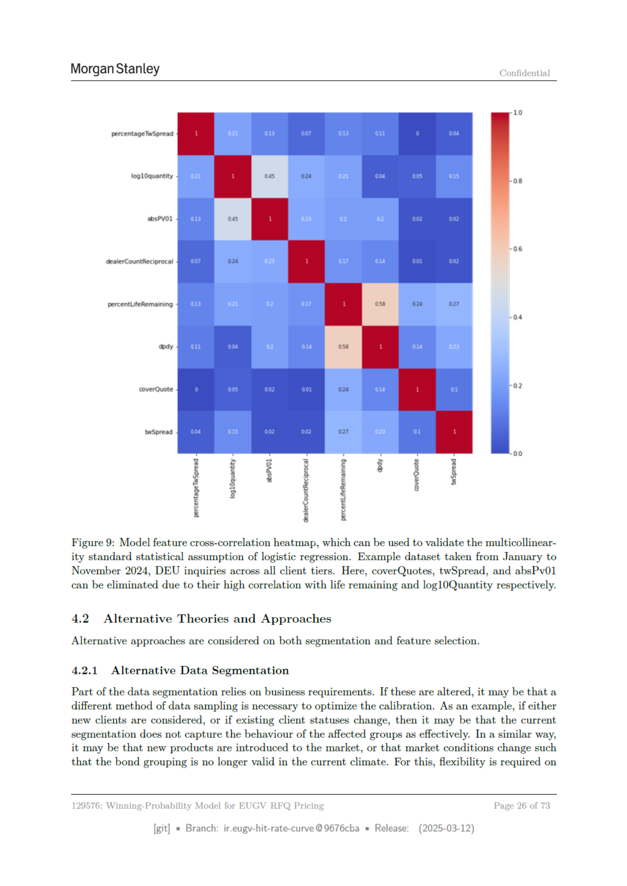

# Page 026 - 日本語版



## 日本語メモ

**該当箇所:** 4 Model Development and Selection Process

セグメンテーション、特徴量選択、代替アプローチ、ステークホルダーや独立ソースからの貢献を整理する。

## 原文OCR/Text Layer

> OCR由来のため、誤認識があります。正確な図表・数式・レイアウトは上のページ画像を確認してください。

```text
Morgan Stanley
Confidential
10
percentageTwSpread
loglOquantity
os
absPVO}
+06
ealerCountReciprocal
percentLifeRemaining
+04
pay
coverQuote
02
twSpread
Tr)
PPP
Ppeg
s
$3
5
if
§
2
‘
toi
Figure 9: Model feature cross-correlation heatmap, which can be used to validate the multicollinear-
ity standard statistical assumption of logistic regression. Example dataset taken from January to
November 2024, DEU inquiries across all client tiers. Here, coverQuotes, twSpread, and absPv01
can be eliminated due to their high correlation with life remaining and log10Quantity respectively.
4.2
Alternative Theories and Approaches
Alternative approaches are considered on both segmentation and feature selection.
4.2.1
Alternative Data Segmentation
Part of the data segmentation relies on business requirements. If these are altered, it may be that a
different method of data sampling is necessary to optimize the calibration. As an example, if either
new clients are considered, or if existing client statuses change, then it may be that the current
segmentation does not capture the behaviour of the affected groups as effectively. In a similar way,
it may be that new products are introduced to the market, or that market conditions change such
that the bond grouping is no longer valid in the current climate. For this, flexibility is required on
129576: Winning-Probability Model for EUGV RFQ Pricing
age
26 of 73
[git]
Branch: ir.eugy-hit-rate-curve @9676cba
= Release:
(2025-03-12)
```
