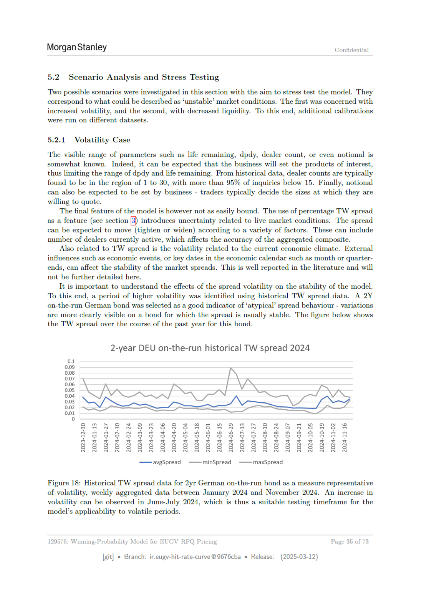

# Page 035 - 日本語版



## 日本語メモ

**該当箇所:** 5.2 Scenario Analysis and Stress Testing

ボラティリティケースと流動性ケースでのストレステスト。市場不安定化や低流動性下での性能を確認する。

## 原文OCR/Text Layer

> OCR由来のため、誤認識があります。正確な図表・数式・レイアウトは上のページ画像を確認してください。

```text
Morgan Stanley
Confidential
5.2
Scenario Analysis and Stress Testing
‘Two possible scenarios were investigated in this section with the aim to stress test the model. They
correspond to what could be described as ‘unstable’ market conditions. The first was concerned with
increased volatility, and the second, with decreased liquidity. To this end, additional calibrations
were run on different datasets.
5.2.1
Volatility Case
The visible range of parameters such as life remaining, dpdy, dealer count, or even notional is
somewhat known. Indeed, it can be expected that the business will set the products of interest,
thus limiting the range of dpdy and life remaining. From historical data, dealer counts are typically
found to be in the region of 1 to 30, with more than 95% of inquiries below 15. Finally, notional
can also be expected to be set by business - traders typically decide the sizes at which they are
willing to quote.
The final feature of the model is however not as easily bound. The use of percentage TW spread
as a feature (see section |3) introduces uncertainty related to live market conditions. The spread
can be expected to move (tighten or widen) according to a variety of factors. These can include
number of dealers currently active, which affects the accuracy of the aggregated composite.
Also related to TW spread is the volatility related to the current economic climate. External
influences such as economic events, or key dates in the economic calendar such as month or quarter-
ends, can affect the stability of the market spreads. This is well reported in the literature and will
not be further detailed here.
It is important to understand the effects of the spread volatility on the stability of the model.
To this end, a period of higher volatility was identified using historical TW spread data.
A 2Y
on-the-run German bond was selected as a good indicator of ‘atypical’ spread behaviour - variations
are more clearly visible on a bond for which the spread is usually stable. The figure below shows
the TW spread over the course of the past year for this bond.
2-year DEU on-the-run historical TW spread 2024
0.1
009
008
007
006
0.05
0.04
003
002
001
avgSpread
minSpread
maxSpread
Figure 18: Historical TW spread data for 2yr German on-the-run bond as a measure representative
of volatility, weekly aggregated data between January 2024 and November 2024. An increase in
volatility can be observed in June-July 2024, which is thus a suitable testing timeframe for the
model’s applicability to volatile periods.
129576: Winning-Probability Model for EUGV RFQ Pricing
[git]
Branch: ir.eugy-hit-rate-curve @9676cba
= Release:
(2025-03-12)
```
