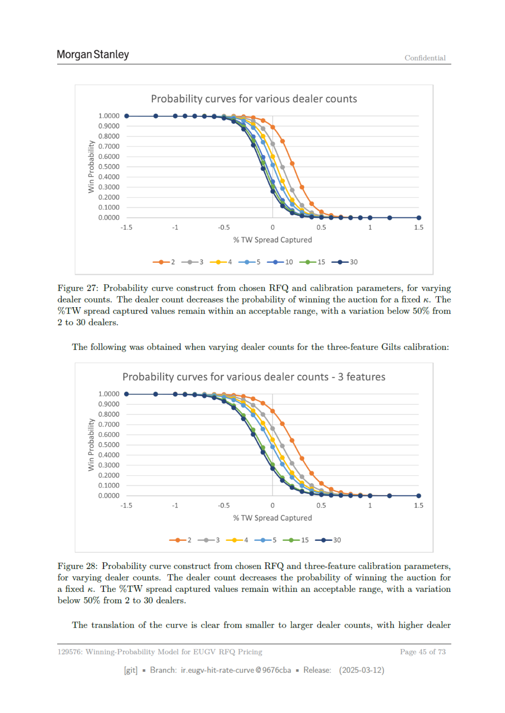

# Page 045 - 日本語版



## 日本語メモ

**該当箇所:** 5.3 Sensitivity Analysis / 5.4 Benchmarking

market spread captured、dealer count、life remaining、duration/PV01、notional等への感応度と、外部・内部ベンチマークとの比較。

## 原文OCR/Text Layer

> OCR由来のため、誤認識があります。正確な図表・数式・レイアウトは上のページ画像を確認してください。

```text
Morgan Stanley
Confidential
Probability curves for various dealer counts
1.0000
0.9000
0.8000
2 0.7000
2 0.6000
6 0.5000
© 0.4000
= 0.3000
0.2000
0.1000
0.0000
“15
“1
05
0
05
1
15
% TW Spread Captured
—e-2 -©-3 -e-4 -e-5 -e-10 -0-15 —e-30
Figure 27: Probability curve construct from chosen RFQ and calibration parameters, for varying
dealer counts. The dealer count decreases the probability of winning the auction for a fixed «. The
%TW spread captured values remain within an acceptable range, with a variation below 50% from
2 to 30 dealers.
The following was obtained when varying dealer counts for the three-feature Gilts calibration:
Probability curves for various dealer counts - 3 features
1.0000
0.9000
0.8000
2 0.7000
2 0.6000
6 0.5000
© 0.4000
= 0.3000
0.2000
0.1000
0.0000
“15
“1
05
0
05
1
15
% TW Spread Captured
—e-2 —0-3 —e-4 —e-5 —e-15 —0-30
Figure 28: Probability curve construct from chosen RFQ and three-feature calibration parameters,
for varying dealer counts. The dealer count decreases the probability of winning the auction for
a fixed x. The %TW spread captured values remain within an acceptable range, with a variation
below 50% from 2 to 30 dealers.
The translation of the curve is clear from smaller to larger dealer counts, with higher dealer
: Winning-Probability Model for
EUGV RFQ Pricing
Page
45 of 73
[git]
Branch: ir.eugy-hit-rate-curve @9676cba
= Release:
(2025-03-12)
```
