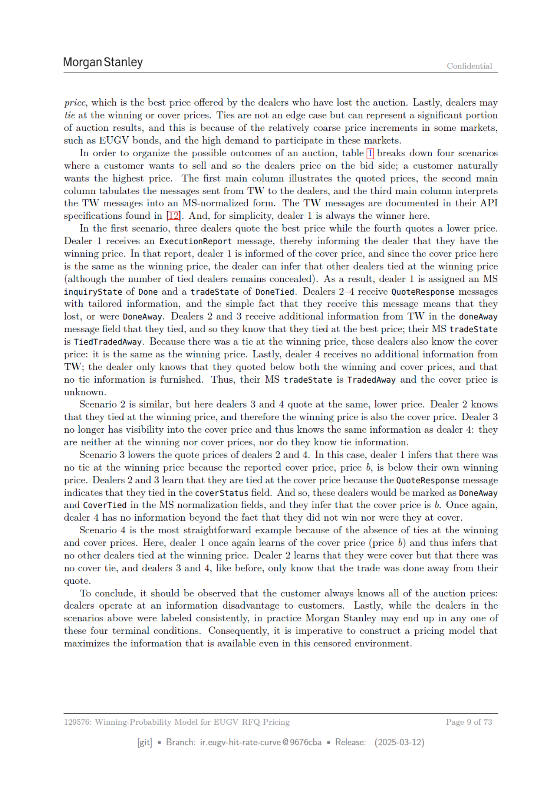

# Page 9



## Extracted OCR/Text Layer

```text
Morgan Stanley
Confidential
price, which is the best price offered by the dealers who have lost the auction. Lastly, dealers may
tie at the winning or cover prices. Ties are not an edge case but can represent a significant portion
of auction results, and this is because of the relatively coarse price increments in some markets,
such as EUGV bonds, and the high demand to participate in these markets.
In order to organize the possible outcomes of an auction, table [I] breaks down four scenarios
where a customer wants to sell and so the dealers price on the bid side;
a customer naturally
wants the highest price.
The first main column illustrates the quoted prices, the second main
column tabulates the messages sent from TW to the dealers, and the third main column interprets
the TW messages into an MS-normalized form. The TW messages are documented in their API
specifications found in [TZ]. And, for simplicity, dealer 1 is always the winner here.
In the first scenario, three dealers quote the best price while the fourth quotes a lower price.
Dealer
1 receives an ExecutionReport message, thereby informing the dealer that they have the
winning price. In that report, dealer 1 is informed of the cover price, and since the cover price here
is the same as the winning price, the dealer can infer that other dealers tied at the winning price
(although the number of tied dealers remains concealed). As a result, dealer 1 is assigned an MS
inquiryState of Done and a tradeState of DoneTied. Dealers 2-4 receive QuoteResponse messages
with tailored information, and the simple fact that they receive this message means that they
lost, or were DoneAway. Dealers 2 and 3 receive additional information from TW in the doneAway
message field that they tied, and so they know that they tied at the best price; their MS tradeState
is TiedTradedAway. Because there was a tie at the winning price, these dealers also know the cover
price: it is the same as the winning price. Lastly, dealer 4 receives no additional information from
TW; the dealer only knows that they quoted below both the winning and cover prices, and that
no tie information
is furnished. Thus, their MS tradeState
is TradedAway and the cover price is
unknown.
Scenario 2 is similar, but here dealers 3 and 4 quote at the same, lower price. Dealer 2 knows
that they tied at the winning price, and therefore the winning price is also the cover price. Dealer 3
no longer has visibility into the cover price and thus knows the same information as dealer 4: they
are neither at the winning nor cover prices, nor do they know tie information.
Scenario 3 lowers the quote prices of dealers 2 and 4. In this case, dealer 1 infers that there was
no tie at the winning price because the reported cover price, price b, is below their own winning
price. Dealers 2 and 3 learn that they are tied at the cover price because the QuoteResponse message
indicates that they tied in the coverStatus field. And so, these dealers would be marked as DoneAway
and CoverTied in the MS normalization fields, and they infer that the cover price is b. Once again,
dealer 4 has no information beyond the fact that they did not win nor were they at cover.
Scenario 4 is the most straightforward example because of the absence of ties at the winning
and cover prices. Here, dealer 1 once again learns of the cover price (price 6) and thus infers that
no other dealers tied at the winning price. Dealer 2 learns that they were cover but that there was
no cover tie, and dealers 3 and 4, like before, only know that the trade was done away from their
quote.
To conclude, it should be observed that the customer always knows all of the auction prices:
dealers operate at an information disadvantage to customers.
Lastly, while the dealers in the
scenarios above were labeled consistently, in practice Morgan Stanley may end up in any one of
these four terminal conditions. Consequently, it is imperative to construct a pricing model that
maximizes the information that is available even in this censored environment.
129576: Winning-Probability Model for
EUGV RFQ Pricing
Page
9 of 73
[git]
= Branch:
ir.eugy-hit-rate-curve @9676cba
= Release:
(2025-03-12)

```
