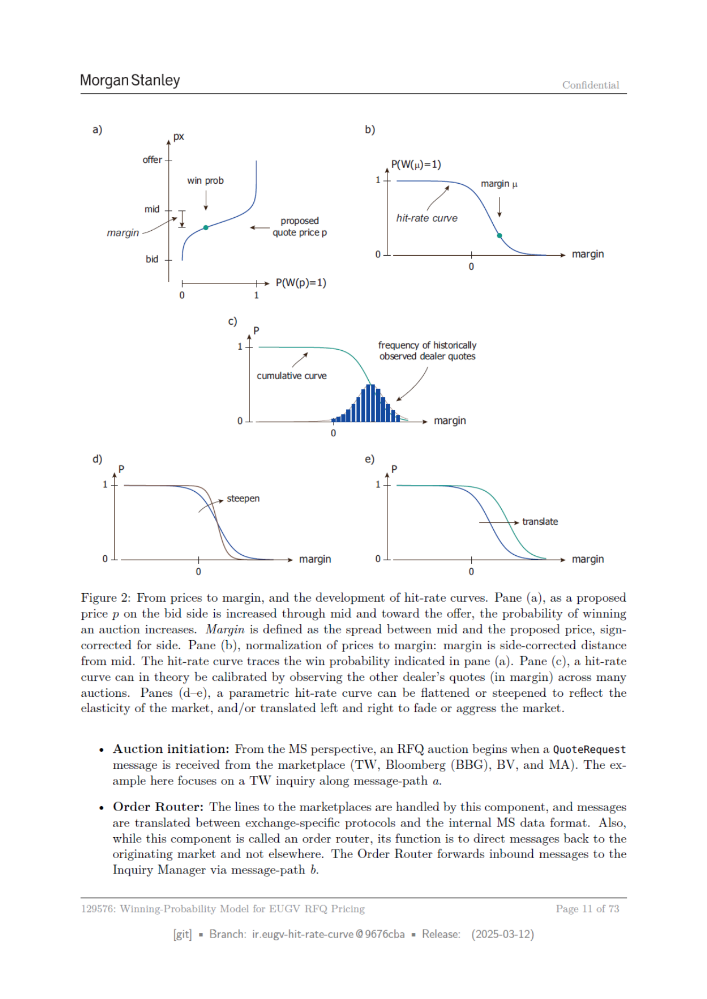

# Page 11



## Extracted OCR/Text Layer

```text
Morgan Stanley
Confidential
a
b
)
px
)
offer
PCW(u)=1)
win prob
1
margin jt
na |,
|
Ty
proposed
hit-rate curve
margin
<— quote price p
bid
0
margin
0
+> PW(p)=1)
0
1
¢ >
1
frequency of historically
ZA
observed dealer quotes
cumulative curve
0
margin
0
d)
e)
Pp
Pp
1
1
steepen
translate
0
margin
0
margin
0
0
Figure 2: From prices to margin, and the development of hit-rate curves. Pane (a), as a proposed
price p on the bid side is increased through mid and toward the offer, the probability of winning
an auction increases. Margin is defined as the spread between mid and the proposed price, sign-
corrected for side. Pane (b), normalization of prices to margin: margin is side-corrected distance
from mid. The hit-rate curve traces the win probability indicated in pane (a). Pane (c), a hit-rate
curve can in theory be calibrated by observing the other dealer's quotes (in margin) across many
auctions.
Panes (d-e), a parametric hit-rate curve can be flattened or steepened to reflect the
elasticity of the market, and/or translated left and right to fade or aggress the market.
+ Auction initiation: From the MS perspective, an RFQ auction begins when a QuoteRequest
message is received from the marketplace (TW, Bloomberg (BBG), BV, and MA). The ex-
ample here focuses on a TW inquiry along message-path a.
« Order Router: The lines to the marketplaces are handled by this component, and messages
are translated between exchange-specific protocols and the internal MS data format. Also,
while this component is called an order router, its function is to direct messages back to the
originating market and not elsewhere. The Order Router forwards inbound messages to the
Inquiry Manager via message-path b.
: Winning-Probability Model for EUGV RFQ Pricing
Page 11 of 73
[git]
= Branch:
ir.eugy-hit-rate-curve @9676cba
= Release:
(2025-03-12)

```
