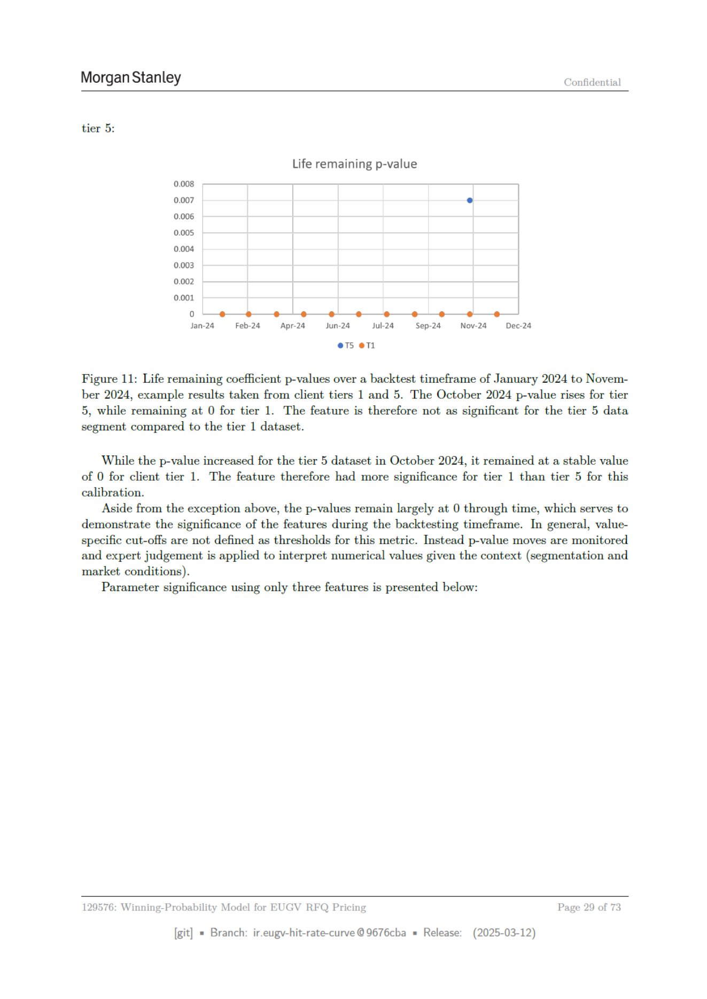

# Page 29



## Extracted OCR/Text Layer

```text
Morgan Stanley
Confidential
tier 5:
Life remaining p-value
0.008
0007
e
0.006
0.005
0.004
0.003
0.002
0001
0
Jan-24 — Feb-24
= Apr-24-—Jun-24—Jul-2@_—Sep-24
= Nov-24—Dec-24
es eT1
Figure 11: Life remaining coefficient p-values over a backtest timeframe of January 2024 to Novem-
ber 2024, example results taken from client tiers 1 and 5. The October 2024 p-value rises for tier
5, while remaining at 0 for tier 1. The feature is therefore not as significant for the tier 5 data
segment compared to the tier 1 dataset.
While the p-value increased for the tier 5 dataset in October 2024, it remained at a stable value
of 0 for client tier
1.
The feature therefore had more significance for tier
1 than tier 5 for this
calibration.
Aside from the exception above, the p-values remain largely at 0 through time, which serves to
demonstrate the significance of the features during the backtesting timeframe.
In general, value-
specific cut-offs are not defined as thresholds for this metric. Instead p-value moves are monitored
and expert judgement is applied to interpret numerical values given the context (segmentation and
market conditions).
Parameter significance using only three features is presented below:
129576: Winning-Probability Model for EUGV RFQ Pricing
Page 29 of 73
[git]
Branch: ir.eugy-hit-rate-curve @9676cba
= Release:
(2025-03-12)

```
