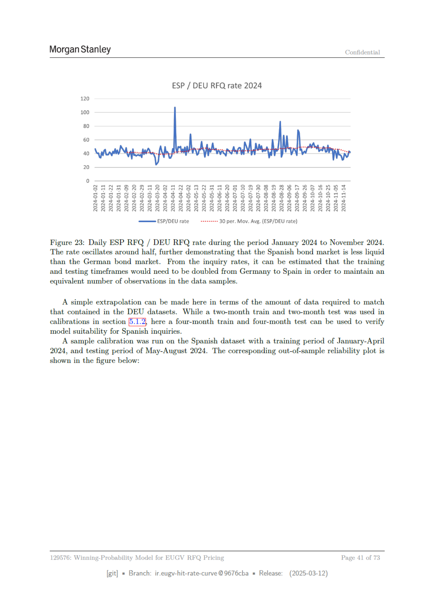

# Page 41



## Extracted OCR/Text Layer

```text
Morgan Stanley
Confidential
ESP / DEU RFQ rate 2024
120
100
80
60
40
20
—ESP/DEU rate
«++++++++
30 per Mov. Avg (ESP/DEU rate)
Figure 23: Daily ESP RFQ / DEU RFQ rate during the period January 2024 to November 2024.
The rate oscillates around half, further demonstrating that the Spanish bond market is less liquid
than the German bond market. From the inquiry rates, it can be estimated that the training
and testing timeframes would need to be doubled from Germany to Spain in order to maintain an
equivalent number of observations in the data samples.
A simple extrapolation can be made here in terms of the amount of data required to match
that contained in the DEU datasets. While a two-month train and two-month test was used in
calibrations in section {5.1.2, here a four-month train and four-month test can be used to verify
model suitability for Spanish inquiries.
‘A sample calibration was run on the Spanish dataset with a training period of January-April
2024, and testing period of May-August 2024. The corresponding out-of-sample reliability plot is
shown in the figure below:
129576: Winning-Probability Model for EUGV RFQ Pricing
Page
41 of 73
[git]
Branch: ir.eugy-hit-rate-curve @9676cba
= Release:
(2025-03-12)

```
