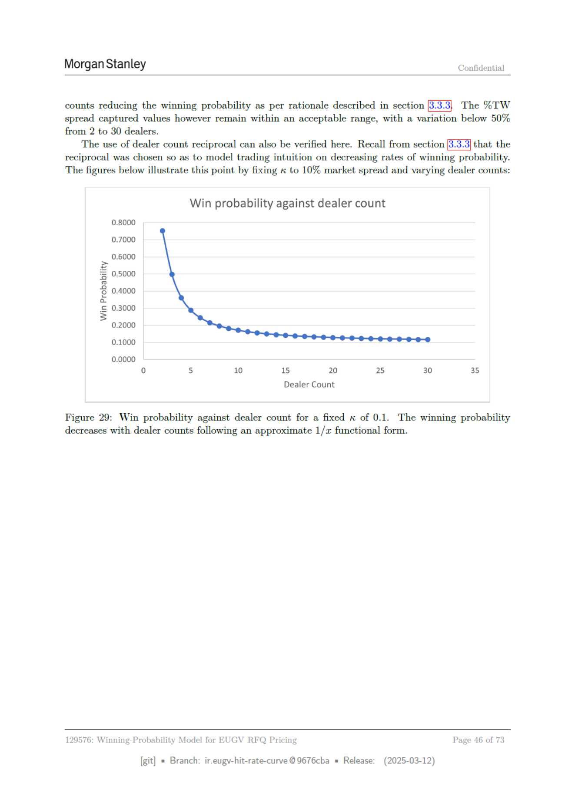

# Page 46



## Extracted OCR/Text Layer

```text
Morgan Stanley
Confidential
counts reducing the winning probability as per rationale described in section
The %TW
spread captured values however remain within an acceptable range, with a variation below 50%
from 2 to 30 dealers.
‘The use of dealer count reciprocal can also be verified here. Recall from sectio:
reciprocal was chosen so as to model trading intuition on decreasing rates of winning probability.
The figures below illustrate this point by fixing x to 10% market spread and varying dealer counts:
Win probability against dealer count
co}
5
10
15
20
25
30
35
Dealer Count
Figure 29: Win probability against dealer count for a fixed « of 0.1.
The winning probability
decreases with dealer counts following an approximate 1/: functional form.
129576: Winning-Probability Model for EUGV RFQ Pricing
Page
46 of 73
[git]
Branch: ir.eugy-hit-rate-curve @9676cba
= Release:
(2025-03-12)

```
