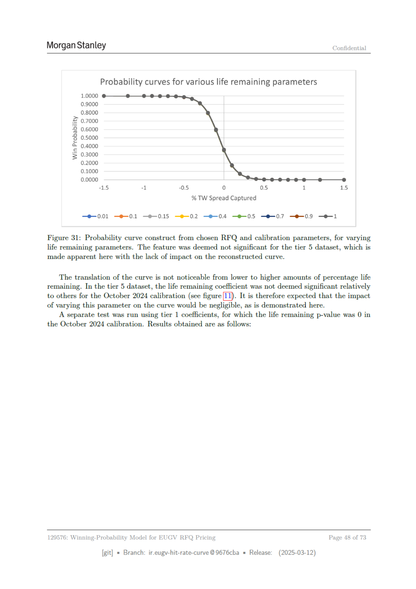

# Page 48



## Extracted OCR/Text Layer

```text
Morgan Stanley
Confidential
Probability curves for various life remaining parameters
1.0000
0.9000
0.8000
2 0.7000
2 0.6000
6 0.5000
© 0.4000
= 0.3000
0.2000
0.1000
0.0000
15
“1
05
0
05
1
15
% TW Spread Captured
—e-0.01
—e-0.1
—e-0.15
—®-0.2
—®-04 —®-05 —®-07 —e-09
—e-1
Figure 31: Probability curve construct from chosen RFQ and calibration parameters, for varying
life remaining parameters. The feature was deemed not significant for the tier 5 dataset, which is
made apparent here with the lack of impact on the reconstructed curve.
The translation of the curve is not noticeable from lower to higher amounts of percentage life
remaining. In the tier 5 dataset, the life remaining coefficient was not deemed significant relatively
to others for the October 2024 calibration (see figure [Ii]. It is therefore expected that the impact
of varying this parameter on the curve would be negligible, as is demonstrated here.
A separate test was run using tier 1 coefficients, for which the life remaining p-value was 0 in
the October 2024 calibration. Results obtained are as follows:
129576: Winning-Probability Model for EUGV RFQ Pricing
Page 48 of 73
[git]
Branch: ir.eugy-hit-rate-curve @9676cba
= Release:
(2025-03-12)

```
