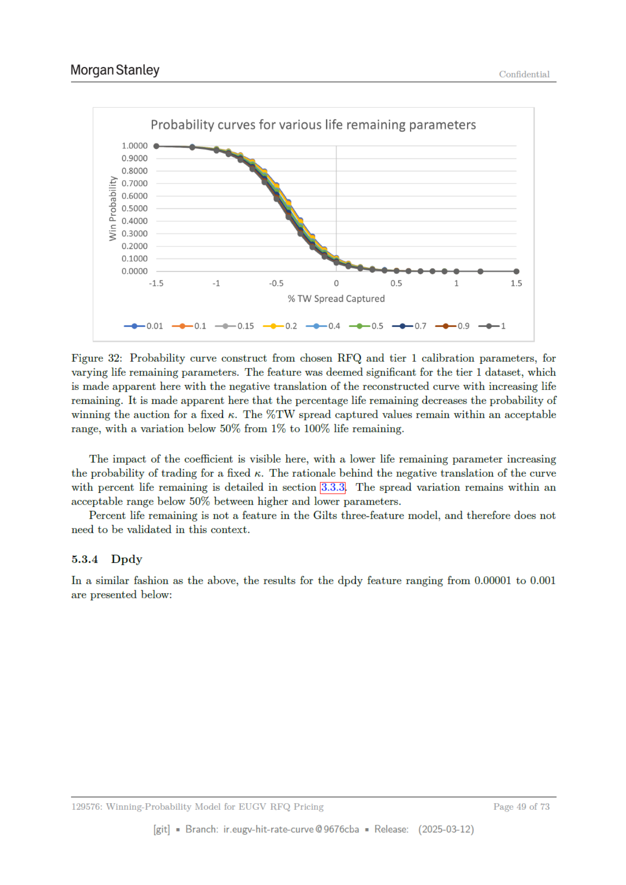

# Page 49



## Extracted OCR/Text Layer

```text
Morgan Stanley
Confidential
Probability curves for various life remaining parameters
1.0000
0.9000
0.8000
2 0.7000
2 0.6000
6 0.5000
© 0.4000
= 0.3000
0.2000
0.1000
0.0000
15
“1
05
0
05
1
15
% TW Spread Captured
—e-0.01
—e-0.1
—e-0.15
—®-0.2
—®-04 —®-05
—®-07 —e-09
—e-1
Figure 32: Probability curve construct from chosen RFQ and tier 1 calibration parameters, for
varying life remaining parameters. The feature was deemed significant for the tier 1 dataset, which
is made apparent: here with the negative translation of the reconstructed curve with increasing life
remaining. It is made apparent here that the percentage life remaining decreases the probability of
winning the auction for a fixed x. The %TW spread captured values remain within an acceptable
range, with a variation below 50% from 1% to 100% life remaining.
The impact of the coefficient is visible here, with a lower life remaining parameter increasing
the probability of trading for a fixed x. The rationale behind the negative translation of the curve
with percent life remaining is detailed in section [3.3.3] The spread variation remains within an
acceptable range below 50% between higher and lower parameters.
Percent life remaining is not a feature in the Gilts three-feature model, and therefore does not
need to be validated in this context.
5.3.4
Dpdy
In a similar fashion as the above, the results for the dpdy feature ranging from 0.00001 to 0.001
are presented below:
129576: Winning-Probability Model for EUGV RFQ Pricing
Page
49 of 73
[git]
Branch: ir.eugy-hit-rate-curve @9676cba
= Release:
(2025-03-12)

```
