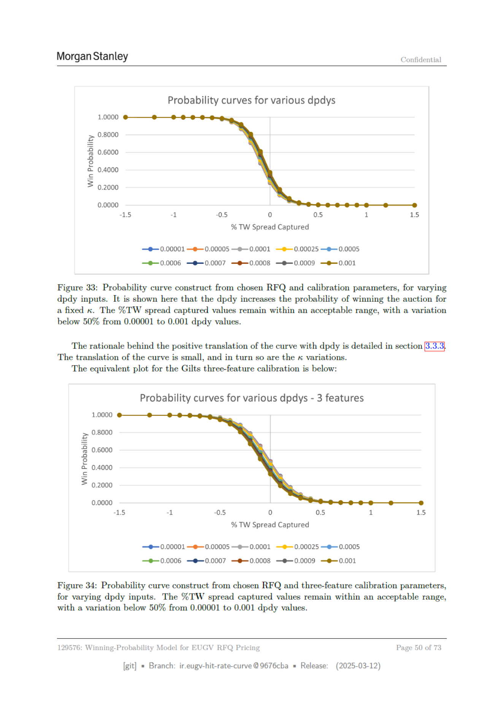

# Page 50



## Extracted OCR/Text Layer

```text
Morgan Stanley
Confidential
Probability curves for various dpdys
1.0000
= 08000
06000
& 0.4000
= 02000
0.0000
“15
-1
-0.5
0
0.5
1
15
% TW Spread Captured
—®— 0.00001 —e—0.00005 —e—0.0001 —e—0.00025 —e—0.0005
—®—0.0006 —®—0.0007
—e®—0.0008 —®—0.0009 —®—0.001
Figure 33: Probability curve construct from chosen RFQ and calibration parameters, for varying
dpdy inputs. It is shown here that the dpdy increases the probability of winning the auction for
a fixed x. The %TW spread captured values remain within an acceptable range, with a variation
below 50% from 0.00001 to 0.001 dpdy values.
The rationale behind the positive translation of the curve with dpdy is detailed in section [3.3.3}
The translation of the curve is small, and in turn so are the « variations.
The equivalent plot for the Gilts three-feature calibration is below:
Probability curves for various dpdys - 3 features
1.0000
2 0.8000
3
0.6000
a
0.4000
=
0.2000
0.0000
“15
a
-0.5
0
0.5
1
15
% TW Spread Captured
—e—0.00001 -e—0 00005 -e—0.0001 —e—0 00025
—-e— 0.0005
—e—0.0006 —e—00007 —e—0.0008 —e—00009 —e—0.001
Figure 34: Probability curve construct from chosen RFQ and three-feature calibration parameters,
for varying dpdy inputs. The %TW spread captured values remain within an acceptable range,
with a variation below 50% from 0.00001 to 0.001 dpdy values.
129576: Winning-Probability Model for EUGV RFQ Pricing
Page 50 of 73
[git]
Branch: ir.eugy-hit-rate-curve @9676cba
= Release:
(2025-03-12)

```
