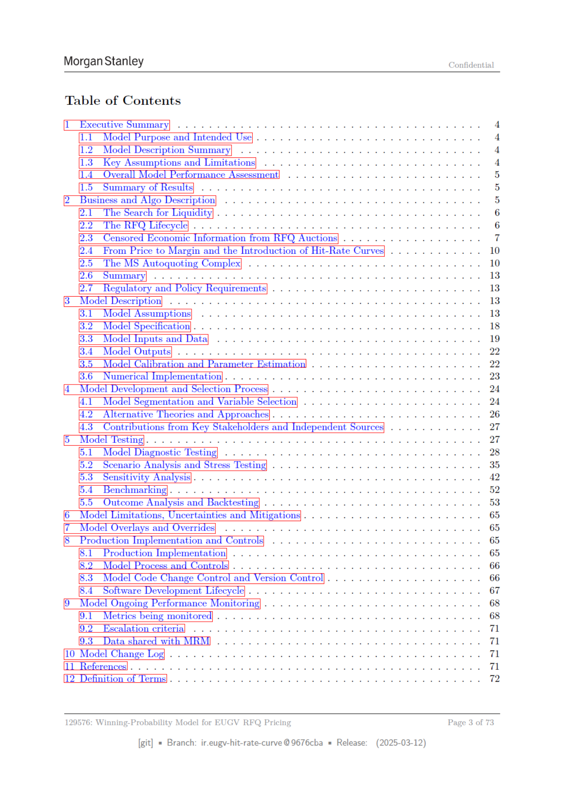

# Page 003 - 全文日本語訳

## 日本語全文訳

モルガン・スタンレー
機密

目次
T-1__モデルの目的と使用意図
L2__モデル説明概要...
L3_主要な前提条件と制限事項。
4
全体的なモデル性能評価
5
結果の要約
2
ビジネスとアルゴリズムの説明|
[3.2 モデル仕様]
[3.3 モデル入力およびデータ]
3.6 数値実装]
[4 モデル開発と選択プロセス]... 2.6...
ee eee ee
ee
G1 モデル分割と変数選択]
vente ee
[23 拍り売りオークションからのカENSORED経済情報]
[24_価格からマージンへの転換とヒット率曲線の導入)
25
MSオートクォーティング複合体]...
2.6
サマリー
[2.7 監管および政策要件}
3.1 モデル前提条件
(£2 代替理論とアプローチ
(£3 主要なステークホルダーからの貢献
see
[5.2 情景分析とストレステスト]
5.3 敏感性分析]...
2... 2...
54
ベンチマークリング.............
5
結果分析とバックテスト]
(© モデルの制限事項、不確実性および緩和策
[7 モデルオーバライヤーとオーバライド]
© 生産実装とコントロール
.
B.L_
生産実装]
モデルテスト}
8.3
モデルコード変更管理
an
[4 ソフトウェア開発ライフサイクル]
[1 モデル継続的なパフォーマンス監視]
.
9.1 監視指標
9.3 与えられたデータの共有
10 モデル変更ログ
129576:
EUGV拍り売りオプション価格用勝率モデル
[git]
= 分岐:
ir.eugy-hit-rate-curve @9676cba
= 発行日:
(2025-03-12)
ページ 3 of 73

## 翻訳ソース

- OCR: `source_en_pages/page_003.md`
- ページ画像: `../assets/page_images/page_003.png`
- 注意: OCR崩れがある箇所は、ページ画像を正として確認してください。
