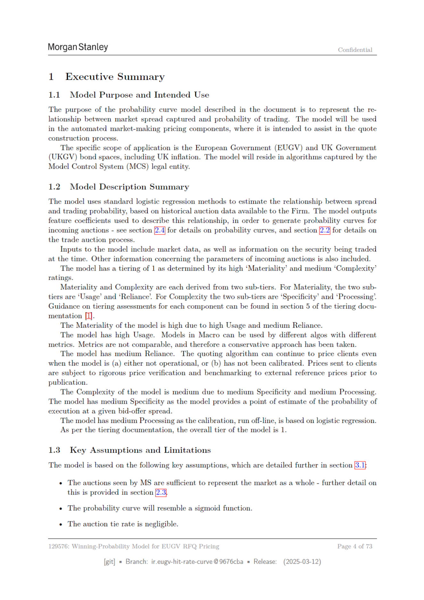

# Page 004 - 全文日本語訳

## 日本語全文訳

モルガン・スタンレー
機密

1. 監査要約
1.1. モデルの目的と使用意図
文書で説明する確率曲線モデルの目的は、市場スプレッド獲得率と取引確率との関係を表すことです。このモデルは自動化されたマーケットメイキングプライシングコンポーネントにおいて、引用構築プロセスを支援するために使用されます。

具体的な適用範囲は、ヨーロッパ政府債券（EUGV）と英国政府債券（UKGV）の市場、およびインフレを含みます。このモデルは法的エンティティであるモデルコントロールシステム（MCS）に含まれるアルゴリズム内に存在します。

1.2. モデルの概要
モデルは標準的なロジスティック回帰方法を使用し、ファームが利用可能な歴史的なオークションデータに基づいてスプレッドと取引確率との関係を推定します。モデルはこの関係を説明するための特性係数を出力し、入札オークションに対する確率曲線を生成するために使用されます。確率曲線に関する詳細については、セクション2を参照してください。また、取引オークションプロセスに関する詳細については、セクション2-|を参照してください。

モデルの入力には、市場データと同時に取引されているセキュリティに関する情報が含まれます。さらに、入札オークションに関連するパラメータに関する他の情報も含まれています。このモデルは「重要性」および「複雑さ」に基づいて1段階に分類されています。

重要性と複雑さはそれぞれ2つのサブ段階から成り立っています。「重要性」の2つのサブ段階は「使用頻度」と「依存度」です。一方、「複雑さ」の2つのサブ段階は「特定性」と「処理量」です。各コンポーネントに対する分類評価に関するガイダンスは、分類ドキュメンテーションセクション5に記載されています。

このモデルの重要性は高いと判断され、これは使用頻度が高く、依存度が中程度であるためです。モデルは高い使用頻度を持っています。マクロ領域でのモデルは異なるアルゴリズムによって異なる指標を使用することができ、これらの指標は比較できませんので、慎重なアプローチが取られています。また、モデルの信頼性は中程度であり、モデルが（a）動作していない場合や（b）校正されていない場合でも、クライアント向けの価格を引き続き設定することができます。送られた価格は出版前に外部参照価格との比較検証を受けます。

このモデルの複雑さは中程度であり、これは特定性と処理量がともに中程度であるためです。モデルは特定性の中程度である理由は、与えられたオファー-オファースプレッドにおける実行確率の点推定を提供するからです。また、このモデルの処理量は中程度であり、校正はロジスティック回帰に基づいてオフラインで行われます。

分類ドキュメンテーションによれば、モデル全体の段階は1段階とされています。

1.3. 主要な仮定と制限事項
モデルは以下の主要な仮定に基づいており、詳細についてはセクション+を参照してください。MSが見ているオークションが市場全体を代表していることを十分に反映しているという仮定です。また、確率曲線はシグモイド関数と類似しているという仮定があります。さらに、入札の引き分け率は無視できるほど低いという仮定もあります。

129576: EUGV RFQ価格用勝率モデル
第4ページ/73ページ
[git]
= ブランチ:
ir.eugy-hit-rate-curve @9676cba
= 発行日:
(2025-03-12)

## 翻訳ソース

- OCR: `source_en_pages/page_004.md`
- ページ画像: `../assets/page_images/page_004.png`
- 注意: OCR崩れがある箇所は、ページ画像を正として確認してください。
