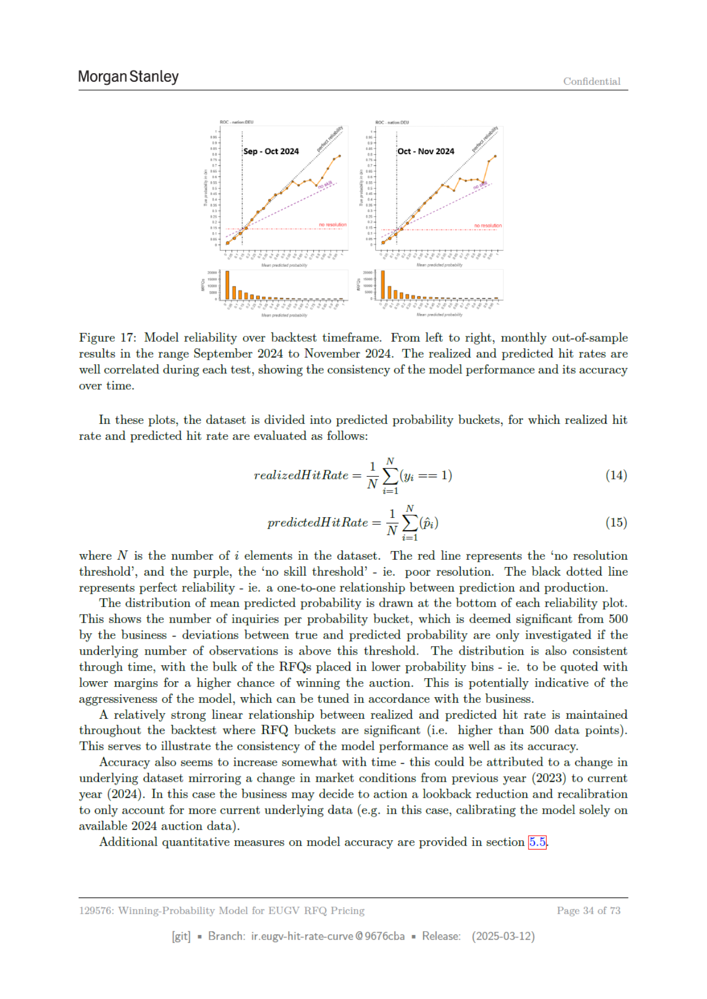

# Page 034 - 全文日本語訳

## 日本語全文訳

モルガン・スタンレー
機密
「Sep-Oct 2024」
「Oct-Nov 2024」

図17: バックテスト期間におけるモデルの信頼性。左から右へと、9月2024年から11月2024年の月ごとのアウトオブサンプル結果が表示されています。実現したヒット率と予測されたヒット率は各テストでよく相関しており、モデルの性能とその正確性が時間とともに一貫していることを示しています。

これらのプロットでは、データセットを予測確率のバケットに分割し、以下のように実現したヒット率と予測されたヒット率を評価します：
\[
\text{実現したヒット率} = \frac{\sum_{i=1}^{N} Y_i}{N}
\]
\[
\text{予測されたヒット率} = \frac{\sum_{i=1}^{N} W_i Y_i}{\sum_{i=1}^{N} W_i}
\]
ここで、\( N \) はデータセット中の \( i \) の要素数です。赤い線は「解釈なしの閾値」を表し、紫の線は「無技能の閾値」 - 即ち、低い解釈能力 - を示します。黒い点線は完全な信頼性を表し、予測と実生産との一対一関係を示します。

各信頼性プロットの下部には平均予測確率の分布が描かれています。これは、ビジネスから500を超える観察数を持つインクエリごとに確率バケット内の件数を示し、真の確率と予測確率との間の偏差はこの閾値を超える場合にのみ調査されます。

また、時間とともに分布も一貫しており、RFQの大半が低い確率バケットに配置されています - 即ち、高い落札確率を得るために低いマージンで提示される可能性があります。これはモデルの攻撃性を示唆する可能性があり、ビジネスはそれに応じて調整を行うことができます。

実現したヒット率と予測されたヒット率との間には、RFQバケットが500を超える場合に強い線形関係が維持されています。これによりモデルの性能の一貫性とその正確性が示されます。

正確さは時間とともに多少増加する傾向があります - これは前年（2023年）から現在年（2024年）までの市場状況の変化を反映したデータセットの変化によるものかもしれません。この場合、ビジネスは過去のデータを考慮に入れないための見直しと再調整を行い、より現行のデータのみに焦点を当てる可能性があります（例えば、この場合、モデルを2024年の落札データだけに基づいて再校正する）。

モデル精度に関する追加の定量的な指標は、第5章で提供されています。

129576: EUGV RFQ価格用の勝率モデル
ページ34/73

[git]
ブランチ:
ir.eugy-hit-rate-curve @9676cba
リリース:
(2025-03-12)

## 翻訳ソース

- OCR: `source_en_pages/page_034.md`
- ページ画像: `../assets/page_images/page_034.png`
- 注意: OCR崩れがある箇所は、ページ画像を正として確認してください。
