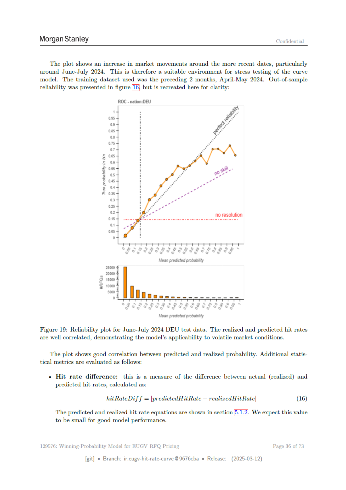

# Page 036 - 全文日本語訳

## 日本語全文訳

モルガン・スタンレー
機密

「このプロットは、最近の日付周辺での市場動向が増加していることを示しています。特に2024年6月から7月までの期間で顕著です。したがって、この期間は曲線モデルに対するストレステストに適した環境と言えます。トレーニングデータセットとしては、前2ヶ月分の2024年4月から5月までのデータを使用しました。アウトオブサンプルの信頼性は図[10]で示されていましたが、明確さのために再作成します：

ROC
- 国: ドイツ
0.95
0.9
0.85
0.8
0.75
0.7
2
3
0.6
4
0.5
S 0.45
0.4
0.35
0.3
0.25
0.15

平均予測確率
平均実現確率

図19: 2024年6月から7月までのドイツのテストデータに対する信頼性プロット。実現したヒットレートと予測されたヒットレートは良好に相関しており、モデルが不安定な市場条件にも適用可能であることを示しています。

「このプロットは、予測された確率と実現確率との間の良好な相関関係を示しています。追加の統計的指標は以下の通り評価されます：
+ ヒットレート差異:
これは実際（実現）と予測されたヒットレートの違いを測定する尺度で、以下のように計算されます：
\[
\text{Hit Rate Difference} = \left| \text{predictedHitRate} - \text{realizedHitRate} \right|
\]
(16)
予測されたヒットレートと実現したヒットレートの式は第12章で示されていますが、これは良いモデル性能を示すために小さいことが望ましいです。

この値は
EUGV RFQ価格設定用勝率モデル
ページ36/73

[git]
ブランチ: ir.eugy-hit-rate-curve @9676cba
リリース日: 2025年3月12日
」

## 翻訳ソース

- OCR: `source_en_pages/page_036.md`
- ページ画像: `../assets/page_images/page_036.png`
- 注意: OCR崩れがある箇所は、ページ画像を正として確認してください。
