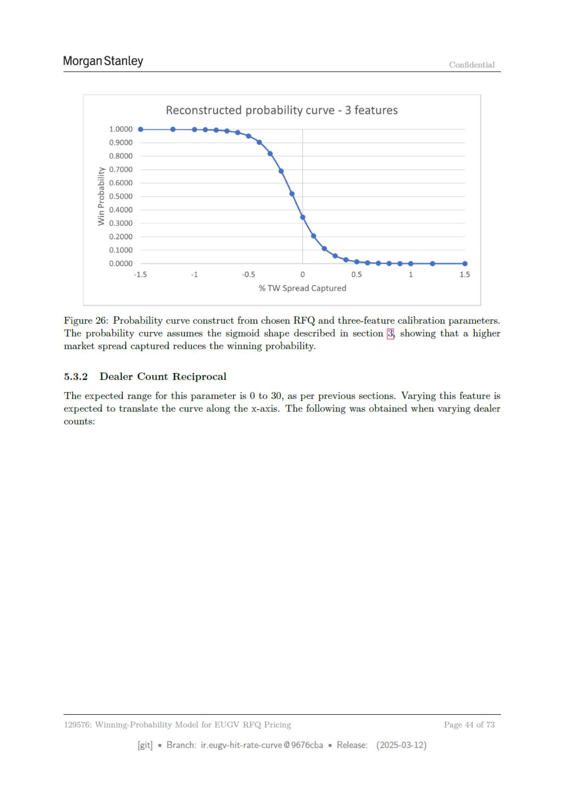

# Page 044 - 全文日本語訳

## 日本語全文訳

モルガン・スタンレー
機密

選択されたRFQと三つの特徴からの構築確率曲線 - 3つの特性
1.0000
0.9000
0.8000
> 0.7000
5 0.6000
8 0.5000
~ 0.4000
3 0.3000
0.2000
0.1000
0.0000
“15
-l
-0.5
0
0.5
1
15
% TW Spread Captured
図26: 読み取られたRFQと三つの特性による確率曲線の構築。
この確率曲線は、セクション[3]で説明したシグモイド形状を仮定しており、市場スプレッド獲得率が高くなるにつれて勝率が低下することを示しています。

5.3.2 ディーラー数の逆数
このパラメータの期待される範囲は0から30です。前節で述べたように、この特性を変更するとx軸方向に曲線が移動することが予想されます。ディーラー数を変更した際の結果は以下の通りです：
129576: EUGV RFQ価格設定用勝率モデル
ページ 44 of 73
[git]
ブランチ: ir.eugy-hit-rate-curve @9676cba
リリース日: (2025-03-12)

## 翻訳ソース

- OCR: `source_en_pages/page_044.md`
- ページ画像: `../assets/page_images/page_044.png`
- 注意: OCR崩れがある箇所は、ページ画像を正として確認してください。
