# Page 047 - 全文日本語訳

## 日本語全文訳

モルガン・スタンレー
機密
取引相手数に対する勝率 - 3つの特徴量

```mermaid
graph LR;
    A[取引相手数] --> B[0.8000]
    B --> C[0.7000]
    C --> D[0.6000]
    D --> E[= 0.5000]
    E --> F[©]
    F --> G[0.4000]
    G --> H[© 0.3000]
    H --> I[0.2000]
    I --> J[0.1000]
    J --> K[0.0000]
    K --> L[0]
    L --> M[5]
    M --> N[10]
    N --> O[1s]
    O --> P[20]
    P --> Q[25]
    Q --> R[30]
    R --> S[35]
    S --> T[取引相手数]
    T --> U(図30: 固定された取引相手数 #1.0 での EUGV RFQ の価格設定用 3つの特徴量による勝率)
```

図30は、固定された取引相手数 #1.0 における Gilt の 3つの特徴量による勝率を示しています。取引相手数が増加するにつれて、勝率は大まかに 1/x の関数の形で減少します。このプロットでは、取引相手数の逆数を使用することの客観的な正当化が確認されます。

5.3.3
残存期間

残存期間のパーセンテージ範囲は0.01から1まで変動させました。これは曲線をx軸方向に移動させることが期待されます。残存期間を変更した結果、次のようなものが得られました：
129576: EUGV RFQ の価格設定用 勝率モデル
ページ 47 of 73

[git]
ブランチ：ir.eugy-hit-rate-curve @9676cba
リリース日：2025-03-12

## 翻訳ソース

- OCR: `source_en_pages/page_047.md`
- ページ画像: `../assets/page_images/page_047.png`
- 注意: OCR崩れがある箇所は、ページ画像を正として確認してください。
