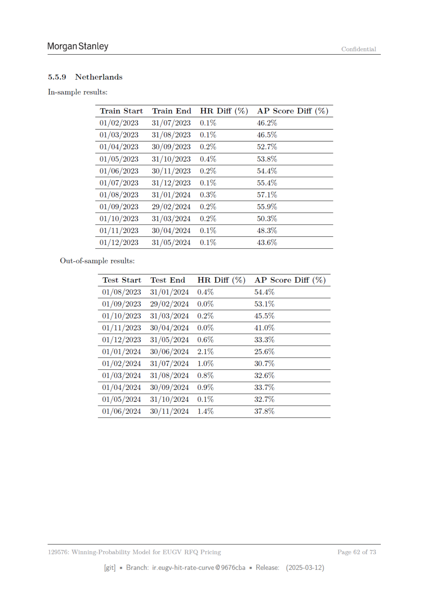

# Page 062 - 全文日本語訳

## 日本語全文訳

モルガン・スタンレー

機密

5.5.9 ネเธอland

インサンプル結果：
トレーニング開始日
トレーニング終了日
HR差（％）
APスコア差（％）
01/02/2023
31/07/2023
0.1%
46.2%
01/03/2023
31/08/2023
0.1%
46.5%
01/04/2023
30/09/2023
0.2%
52.7%
01/05/2023
31/10/2023
0.4%
53.8%
01/06/2023
30/11/2023
0.2%
54.4%
01/07/2023
31/12/2023
0.1%
55.4%
01/08/2023
31/01/2024
0.3%
57.1%
01/09/2023
29/02/2024
0.2%
55.9%
01/10/2023
31/03/2024
0.2%
50.3%
01/11/2023
30/04/2024
0.1%
48.3%
01/12/2023
31/05/2024
0.1%
43.6%

アウトサンプル結果：
テスト開始日
テスト終了日
HR差（％）
APスコア差（％）
01/08/2023
31/01/2024
0.4%
54.4%
01/09/:
29/02/2024
0.0%
53.1%
01/10/2023
31/03/2024
0.2%
45.5%
01/11/2023
30/04/2024
0.0%
41.0%
01/12/2023
31/05/2024
0.6%
33.3%
01/01/2024
30/06/2024
2.1%
25.6%
01/02/2024
31/07/2024
1.0%
30.7%
01/03/2024
31/08/2024
0.8%
32.6%
01/04/2024
30/09/2024
0.9%
33.7%
01/05/2024
31/10/2024
0.1%
32.7%
01/06/2024
30/11/2024
1.4%
37.8%

EUGV RFQプライシング用の勝率モデル

ページ 62 of 73

[git]
= ブランチ:
ir.eugy-hit-rate-curve @9676cba
= 発行版:
(2025-03-12)

## 翻訳ソース

- OCR: `source_en_pages/page_062.md`
- ページ画像: `../assets/page_images/page_062.png`
- 注意: OCR崩れがある箇所は、ページ画像を正として確認してください。
