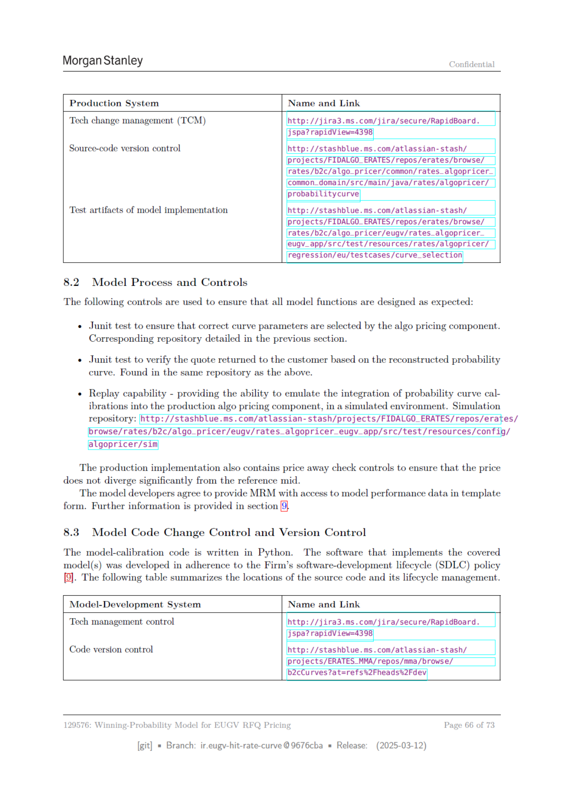

# Page 066 - 全文日本語訳

## 日本語全文訳

### 生産システム

#### 名称とリンク
技術変更管理（TCM）
- [http://jira3.ms.com/jira/secure/RapidBoard.jspa?rapidView=4398](http://jira3.ms.com/jira/secure/RapidBoard.jspa?rapidView=4398)

ソースコード版管理
- [http://stashblue.ms.com/atlassian-stash/projects/FIDALGO_ERATES/repos/erates/browse/rates/b2c/algo_pricer/common/rates_algopricer_common_domain/src/main/java/rates/algopricer/probabilitycurve](http://stashblue.ms.com/atlassian-stash/projects/FIDALGO_ERATES/repos/erates/browse/rates/b2c/algo_pricer/common/rates_algopricer_common_domain/src/main/java/rates/algopricer/probabilitycurve)

#### モデル実装のテストアーティファクト
- [http://stashblue.ms.com/atlassian-stash/projects/FIDALGO_ERATES/repos/erates/browse/rates/b2c/algo_pricer/eugv/rates_algopricer_leugv_app/src/test/resources/rates/algopricer/regression/eu/testcases/curve_selection](http://stashblue.ms.com/atlassian-stash/projects/FIDALGO_ERATES/repos/erates/browse/rates/b2c/algo_pricer/eugv/rates_algopricer_leugv_app/src/test/resources/rates/algopricer/regression/eu/testcases/curve_selection)

### 8.2 モデルプロセスとコントロール

以下のコントロールは、すべてのモデル関数が想定通りに設計されていることを確認するため使用されます：
- Junitテスト：アルゴリズム価格設定コンポーネントによって選択される正しい曲線パラメータを確保します。
  - 前節で詳細が示されています。

- Junitテスト：再構築された確率曲線に基づいて顧客に返されるオファーの確認。上記と同じリポジトリ内にあります。

- リプレイ機能：生産アルゴリズム価格設定コンポーネントへの確率曲線校正統合をシミュレートする能力を提供します。
  - シミュレーションリポジトリ：
    - [http://stashblue.ms.com/atlassian-stash/projects/FIDALGO_ERATES/repos/erates/browse/rates/b2c/algo_pricer/eugv/rates_algopricer_eugv_app/src/test/resources/config/algopricer/sim](http://stashblue.ms.com/atlassian-stash/projects/FIDALGO_ERATES/repos/erates/browse/rates/b2c/algo_pricer/eugv/rates_algopricer_eugv_app/src/test/resources/config/algopricer/sim)

生産実装には、価格が参照中央値から大幅に逸脱しないことを確認するための価格逃れチェックコントロールも含まれています。

モデル開発者は、MRMに対してモデルパフォーマンスデータをテンプレート形式でアクセス提供することに同意しています。詳細は第9節をご覧ください。

### 8.3 モデルコード変更コントロールとバージョン管理

モデル校正コードはPythonで書かれています。
カバーされるモデルの実装ソフトウェアは、会社のソフトウェア開発ライフサイクル（SDLC）ポリシーに従って開発されました。以下の表はソースコードの場所とそのライフサイクル管理を要約しています。

#### モデル開発システム
名称とリンク
技術管理コントロール
- [http://jira3.ms.com/jira/secure/RapidBoard.jspa?rapidView=4398](http://jira3.ms.com/jira/secure/RapidBoard.jspa?rapidView=4398)

コードバージョン管理
- [http://stashblue.ms.com/atlassian-stash/projects/ERATES_MMA/repos/mma/browse/bacCurves?at=refs%2Fheads%2Fdev](http://stashblue.ms.com/atlassian-stash/projects/ERATES_MMA/repos/mma/browse/bacCurves?at=refs%2Fheads%2Fdev)

129576: EUGV RFQ価格設定用勝率モデル
- [git]
  - 分岐：
    - ir.eugy-hit-rate-curve @9676cba
  - 発行：
    - (2025-03-12)

## 翻訳ソース

- OCR: `source_en_pages/page_066.md`
- ページ画像: `../assets/page_images/page_066.png`
- 注意: OCR崩れがある箇所は、ページ画像を正として確認してください。
