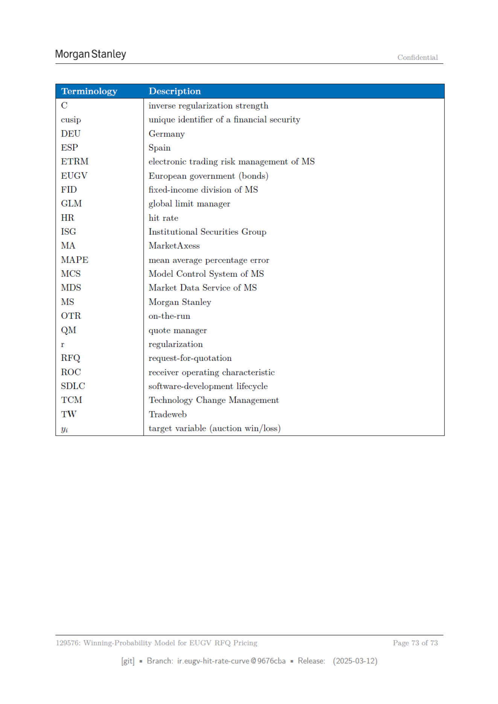

# Page 073 - 全文日本語訳

## 日本語全文訳

### 12 用語の定義

専門用語の定義を行います。以下に、RFQ、BMET、GLM、MCS、TW、UKGV、EUGVなどの略語や用語を整理します。

- **inverse regularization strength**: 逆正則化強度
- **cusip**: 財務商品の一意識別子
- **DEU**: ドイツ
- **ESP**: スペイン
- **ETRM**: MSの電子取引リスク管理
- **EUGV**: 欧州政府（債券）
- **FID**: MSの固定収入部門
- **GLM**: 全球制限管理者
- **HR**: ヒット率
- **ISG**: 机构证券集团
- **MA**: MarketAxess
- **MAPE**: 平均絶対百分比誤差
- **MCS**: MSのモデルコントロールシステム
- **MDS**: MSの市場データサービス
- **MS**: 摩根士丹利
- **OTR**: 新規入札
- **QM**: 見出管理
- **regularization**: 正則化
- **RFQ**: 価格要求
- **ROC**: 受信者操作特性曲線
- **SDLC**: ソフトウェア開発ライフサイクル
- **TCM**: テクノロジー変更管理
- **TW**: Tradeweb
- **Yi**: 目的変数（オークションの勝敗）

**129576: EUGVの価格設定用勝率モデル**

このモデルは、EUGVのRFQ価格設定に使用されます。具体的には、ヒット率曲線を記述するためのもので、最終ページである73ページまで続きます。

[git]
- 分岐：`eugy-hit-rate-curve @9676cba`
- 発行：2025年3月12日

## 翻訳ソース

- OCR: `source_en_pages/page_073.md`
- ページ画像: `../assets/page_images/page_073.png`
- 注意: OCR崩れがある箇所は、ページ画像を正として確認してください。
