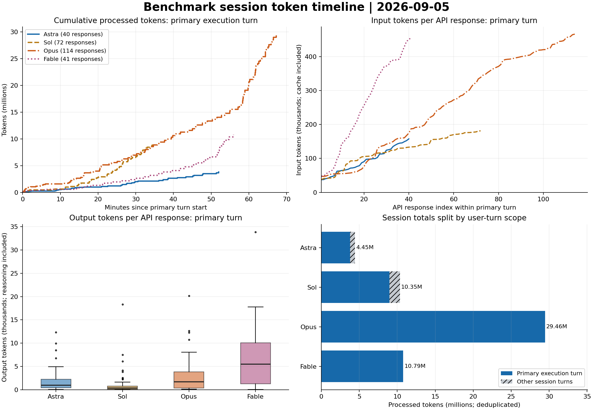

# セッション別・ターン別トークン監査

4セッションのローカルログに記録された使用量を再集計したデータです。`Model Test Prep` は対象外です。

## 集計の訂正

前回のClaude集計はレコードUUIDを優先したため、同じAPI応答がcontent blockごとに二重・多重計上されていました。今回は `message.id` で統合し、`requestId` でも1対1を照合しています。同一応答のusageは全コピーで一致しました。推論量は `output_tokens_details.thinking_tokens` にあり、出力総量の内数として分離できます。

| セッション | API応答数 | 前回報告 | 今回の総量 | 重複分の除去 |
|---|---:|---:|---:|---:|
| Model Test Astra | 52 | 4,446,365 | 4,446,365 | 0 |
| Model Test Sol | 82 | 10,349,887 | 10,349,887 | 0 |
| model-test-opus | 114 | 53,575,487 | 29,457,223 | 24,118,264 |
| model-test-fable | 41 | 29,313,090 | 10,790,902 | 18,522,188 |

## セッション内の重複しない内訳

| モデル | 非キャッシュ入力 | キャッシュ読取 | キャッシュ作成 | 推論出力 | 非推論出力 | 合計 |
|---|---:|---:|---:|---:|---:|---:|
| Astra | 262,976 | 4,097,280 | 0 | 35,289 | 50,820 | 4,446,365 |
| Sol | 176,855 | 10,096,128 | 0 | 25,905 | 50,999 | 10,349,887 |
| Opus | 228 | 28,715,729 | 439,475 | 117,873 | 183,918 | 29,457,223 |
| Fable | 1,222 | 9,739,461 | 772,961 | 119,154 | 158,104 | 10,790,902 |

## ターン別

ターンはユーザーの実際の依頼1回から、その応答・ツール実行が終わるまでです。Claudeのツール結果（role=user）、ローカルコマンド、システム通知、自動要約は新しいユーザーターンに数えません。

| セッション | ターン | 作業 | 開始–終了（JST） | 分 | API応答 | 合計tokens | 推論 | 非推論出力 |
|---|---:|---|---|---:|---:|---:|---:|---:|
| Model Test Astra | 1 | 初回準備 | 09:40:55–09:41:24 | 0.49 | 2 | 57,748 | 516 | 215 |
| Model Test Astra | 2 | ベンチマーク指示・確認 | 10:21:49–10:23:07 | 1.31 | 7 | 236,614 | 723 | 701 |
| Model Test Astra | 3 | モデル名確認 | 10:23:08–10:23:19 | 0.19 | 1 | 36,929 | 195 | 46 |
| Model Test Astra | 4 | ベンチマーク本実行 | 10:23:54–11:15:52 | 51.97 | 40 | 3,797,692 | 33,681 | 49,539 |
| Model Test Astra | 5 | 終了後のグラフ表示 | 11:37:38–11:38:05 | 0.45 | 2 | 317,382 | 174 | 319 |
| Model Test Sol | 1 | 初回準備（中断） | 09:41:32–09:42:17 | 0.76 | 3 | 97,182 | 647 | 660 |
| Model Test Sol | 2 | ベンチマーク本実行 | 10:21:56–10:56:32 | 34.60 | 72 | 8,975,027 | 24,582 | 49,419 |
| Model Test Sol | 3 | モデル名確認 | 10:56:32–10:56:41 | 0.15 | 1 | 181,577 | 54 | 13 |
| Model Test Sol | 4 | 出力先確認 | 11:29:21–11:29:31 | 0.16 | 1 | 181,801 | 100 | 106 |
| Model Test Sol | 5 | 出力先修正の依頼 | 11:30:09–11:30:51 | 0.70 | 4 | 731,055 | 469 | 625 |
| Model Test Sol | 6 | 終了後のグラフ表示 | 11:37:25–11:37:32 | 0.12 | 1 | 183,245 | 53 | 176 |
| model-test-opus | 1 | ベンチマーク本実行 | 10:22:15–11:32:08 | 69.88 | 114 | 29,457,223 | 117,873 | 183,918 |
| model-test-fable | 1 | ベンチマーク本実行 | 10:22:09–11:18:06 | 55.94 | 41 | 10,790,902 | 119,154 | 158,104 |

## 本実行の比較

本実行はAstraのターン4、Solのターン2、Opus/Fableのターン1です。各依頼の内容とログ上のイベント境界を照合して選びました。Astraの追加パス確認やSolの終了後出力先修正は別ターンです。この差があるため、本実行だけの比較と全セッション比較の両方を残しています。

| モデル | 本実行時間（分） | API応答 | 平均入力/応答 | 平均出力/応答 | 本実行総量 |
|---|---:|---:|---:|---:|---:|
| Astra | 51.97 | 40 | 92,862 | 2,080 | 3,797,692 |
| Sol | 34.60 | 72 | 123,625 | 1,028 | 8,975,027 |
| Opus | 69.88 | 114 | 255,749 | 2,647 | 29,457,223 |
| Fable | 55.94 | 41 | 256,430 | 6,762 | 10,790,902 |

## この実行で観測できる進め方の違い

- Astraは本実行40応答、Solは72応答。Solは応答回数が多く、平均入力文脈も大きいため、本実行の処理総量が増えています。出力総量だけを見るとAstraは83,220、Solは74,001です。
- Opusは114応答、Fableは41応答。両者の平均入力は約256,000トークンで近い一方、平均出力はOpus約2,647、Fable約6,762です。この実行ではFableは少ない応答に大きな出力をまとめる傾向がありました。
- 入力文脈が積み重なるため、後半の1応答は前半より処理量が大きくなります。総トークンが多いことは、その分だけ新しいコードや推論を生成したことを意味しません。
- Solには本実行終了後の出力先修正依頼ターンがあり、その使用量は731,055です。本実行の34.60分だけを『完全な引き渡しまでの時間』とは扱えません。
- Opus末尾には自動要約イベントがあります。記録されたturn_durationにはこの待ち時間も含まれ、API応答の単純な生成速度とは異なります。

以下は本実行で出力が大きかったAPI応答です。作業タグは同じ応答に付随するツール操作を示し、思考内容や厳密な目的別コストを表しません。

| モデル | セッション内API番号 | 記録時刻（JST） | 出力合計 | 推論 | 非推論 | 作業タグ |
|---|---:|---|---:|---:|---:|---|
| Astra | 17 | 10:32:28 | 12,326 | 4,802 | 7,524 | write_edit |
| Astra | 39 | 11:00:02 | 9,929 | 1,918 | 8,011 | write_edit |
| Sol | 14 | 10:29:31 | 18,321 | 6,792 | 11,529 | write_edit |
| Sol | 16 | 10:32:46 | 7,526 | 9 | 7,517 | write_edit |
| Opus | 25 | 10:33:02 | 20,138 | 19,421 | 717 | read_inspect |
| Opus | 40 | 10:41:13 | 12,659 | 3,707 | 8,952 | write_edit |
| Fable | 9 | 10:36:13 | 33,837 | 33,090 | 747 | test_command |
| Fable | 7 | 10:26:34 | 17,756 | 14,884 | 2,872 | write_edit |



## ファイル

- `api_responses.csv`: API応答ごとの使用量、推論内訳、ユーザーターン、記録時刻、累積量、ツール活動。
- `user_turns.csv`: ユーザー依頼単位の使用量、実時間、API数。
- `timeline_5min.csv`: JSTの5分窓ごとのトークン量。記録がない窓はCSVに行を作りません。
- `session_summary.csv`: セッション・本実行の集計。
- `tool_events.csv`: ツール名、時刻、粗い作業分類、明示的エラーフラグ。本文やコマンド全文は含みません。
- `audit.json`: ログの絶対パス、SHA-256、重複除去件数、照合結果、実行環境。
- `token_timeline.png` / `.svg`: 保存用の時系列・入力文脈量・出力分布・ターン範囲比較。

## 定義・検証・限界

1. Codexは `token_usage_record.usage` をresponse_idで一意化して合算。別系統の `token_count.total_token_usage` と最終thread counterの双方へ一致しました。繰り返し累計イベントは二重計上しません。
2. Claudeはmessage.idで一意化。requestIdも照合。usageの値が同一ID内で異なる場合やJSON破損は黙って無視せず停止します。Opusの自動要約後にあるsynthetic・ゼロusage応答はAPI数から除外しました。
3. 入力総量＝非キャッシュ入力＋キャッシュ読取＋キャッシュ作成。出力総量＝推論出力＋非推論出力。合計＝入力総量＋出力総量。非推論出力は最終回答だけでなくコード・ツール引数等も含みます。
4. API応答・ユーザーターン・5分窓・セッションの合計は一致し、読取前後の元ログSHA-256も一致しました。入力市場データ・評価器・候補成果物には変更を加えていません。
5. API時刻はログに記録されたusage応答時刻で、推論開始時刻ではありません。Claudeの同一APIの複数blockは最初と最後の記録時刻を両方保存し、時系列集計には最初の時刻を使います。ストリーミング中の秒単位消費は復元できません。
6. 実行時間はユーザーターンの実時間で、ツール待機・要約・一時停止等を含みます。セッション全体の経過時間にはユーザーの返信待ちも入り、APIレイテンシや純粋な生成速度ではありません。
7. `observable_activities` はツール名・引数に基づく粗い分類で、使用量の厳密な作業別帰属ではありません。入力の多くは過去文脈の再読込です。API数・ツール呼出数はクライアントのまとめ方にも依存します。
8. reasoningはログにある数値だけを使用し、思考本文は分析・保存しません。課金・価格は計算していません。総処理トークンはキャッシュ反復と異なるトークナイザを含むため、そのまま能力・コスト・効率の順位にはなりません。
9. 記録されていない内部処理・別子エージェントファイル・API使用量が非公開の要約処理は含みません。これらをゼロコストとみなしません。実行1回ずつの観測であり、モデル固有の性格や品質を断定する根拠ではありません。

## 再実行

```bash
python3.12 /Users/ankimo1210/Documents/projects/quant-agent-benchmark/analysis/session-tokens-20260905/recover_tokens.py
python3.12 -m unittest discover -s /Users/ankimo1210/Documents/projects/quant-agent-benchmark/analysis/session-tokens-20260905 -p 'test_*.py' -v
```

可視化は visualize-data の手順に沿い、合計の照合後に、共通の単位・軸・凡例で出力しています。
